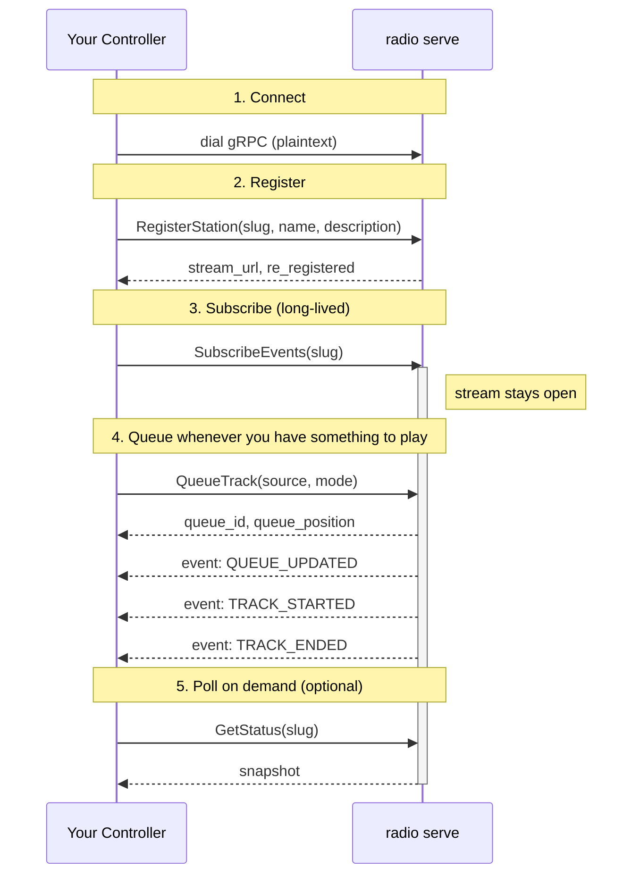

# Writing a Controller

This walks through building a station controller from scratch, in any
language, against the protocol described in the
[Protocol Reference](protocol-reference.md).

It assumes you're using a generated gRPC client, since that's the most
convenient route where a gRPC library is available. If it isn't — an old
runtime, an embedded scripting engine, a 32-bit process — skip step 1 and
call the same RPCs over plain HTTP+JSON instead, per
[HTTP + JSON API](http-json-api.md). Everything from step 2 onwards (the
call order, the reconnect handling) applies either way.

## 1. Generate a client from the schema registry

You don't need this repository at all — the schema is published to a Buf
Schema Registry at `proto.prod.wtf/goradioserver/goradio`.

1. Write a `buf.gen.yaml` naming the plugins for your language. For example, Python:
   ```yaml
   version: v2
   plugins:
     - remote: buf.build/protocolbuffers/python
       out: gen/python
     - remote: buf.build/grpc/python
       out: gen/python
   ```
   Swap in whatever local or remote plugins your language/toolchain uses —
   this works the same way for Node/TS, Java/Kotlin, C#, Rust, Swift, PHP,
   and anything else `buf` has plugins for.
2. Generate directly from the registry:
   ```sh
   buf generate proto.prod.wtf/goradioserver/goradio
   ```

That's it — you now have a generated `AudioServerService` client stub for
your language, kept in sync by re-running that command whenever the schema
changes.

## 2. The call order

This is the part that matters most: the RPCs aren't independent — there's
an expected lifecycle.



1. **Connect** — dial the audio server's gRPC address. Attach your JWT as
   `authorization: Bearer <token>` metadata on every call (most gRPC
   client libraries let you do this once via per-call/per-RPC credentials
   rather than manually on each call — see your language's gRPC docs for
   "call credentials" or "per-RPC credentials").
2. **Register** — call `RegisterStation` with your station's slug, name,
   and description. Do this before anything else; every other RPC targets
   a slug that must already be registered (`QueueTrack`/`SubscribeEvents`
   against an unregistered slug return `NotFound`).
3. **Subscribe** — open `SubscribeEvents` for your slug and keep it open
   for the life of your process. This is how you find out what's actually
   happening (track started/ended, errors, listener count) — `QueueTrack`'s
   response only confirms the item was *accepted*, not that it played.
4. **Queue** — call `QueueTrack` whenever your logic decides something
   should play. Queue ahead of when you need it to start (see
   [Protocol Reference — QueueTrack](protocol-reference.md#queuetrack)) —
   the server prefetches in the background starting the moment you call
   this, not when the item is about to play.
5. **Poll status when useful** — `GetStatus` for an on-demand snapshot
   (e.g. to show a dashboard, or to sanity-check state on startup before
   you've received any events yet). You don't need to poll it to drive
   playback — the event stream is the real-time source of truth.

## Reconnecting

Station registration is **in-memory only** on the audio server — it's
wiped by a `radio serve` restart. Your controller should be able to run
indefinitely across audio-server restarts and network blips without manual
intervention:

- If `RegisterStation` fails because the server is unreachable
  (`codes.Unavailable`), retry with backoff. This call is safe to retry —
  it's idempotent by slug.
- If the `SubscribeEvents` stream errors or closes unexpectedly, assume the
  audio server may have restarted (so your registration may be gone) and:
  1. Call `RegisterStation` again with the same slug/name/description.
  2. Re-open `SubscribeEvents`.
  3. Repeat with backoff if either fails.

!!! warning "Re-registering isn't enough on its own -- the queue needs re-priming too"
    If the audio server actually restarted (not just a network blip), its
    registry is wiped, so the fresh station `RegisterStation` recreates for
    you comes back with an **empty queue** — not the one you'd built up
    before. Re-registering successfully doesn't refill it; whatever logic
    queues your first track needs to run again after every successful
    reconnect-driven re-registration, not just once at startup, or your
    controller silently goes quiet (still connected, still "registered",
    just never queuing anything again) after every audio-server restart.
    `low_queue_threshold`'s edge-triggered low-queue signal doesn't save
    you here either — it only fires transitioning into "low" from
    "not low," which never happens on its own for a queue that's been
    empty since the moment it was recreated.

!!! warning "Don't retry permanent failures forever"
    Distinguish transient errors from permanent ones before you retry.
    `codes.Unauthenticated` (bad/expired/malformed JWT) and
    `codes.PermissionDenied` (token doesn't cover this slug) will **never**
    succeed no matter how many times you retry — retrying them anyway just
    produces an unkillable-looking process that spins forever on a config
    mistake, with no clear error message telling the operator what to fix.
    Fail fast and surface the error instead. Also make sure whatever
    context governs the retry loop is the same one your process cancels on
    `SIGINT`/`SIGTERM` — a retry loop built on `context.Background()`
    won't respond to Ctrl+C at all, transient error or not.

This is exactly what `internal/luastation` (this repo's bundled Lua engine)
does — see [`internal/luastation/engine.go`](https://github.com/goradioserver/goradio/blob/main/internal/luastation/engine.go)
(specifically `registerWithRetry`, `isRetryable`, and `subscribeEventsLoop`'s
`reregisteredCh` signal) if you want a concrete reference implementation of
this reconnect loop, including the queue re-priming above, to port to your
language. A Lua script gets that re-priming hook directly as
[`radio.on_register`](../lua-api/events-and-scheduling.md#radioon_registerfn).

## Things your controller does *not* need to worry about

- **Transcoding** — you hand the server a path or URL; it transcodes to
  the fixed target format and caches the result. You never touch encoded
  audio bytes.
- **Pacing/streaming to listeners** — entirely the audio server's job.
- **Silence fallback** — the server plays a looping silence clip whenever
  your queue is empty; you don't need to queue "nothing" explicitly.
- **Hard-cut correctness** — guaranteed by the server's uniform transcode
  format; you just pick `QUEUE_MODE_APPEND`/`PLAY_NEXT`/`PLAY_NOW_INTERRUPT`.

Everything your controller *is* responsible for is deciding **what** to
queue and **when** — that's the whole point of writing your own.
