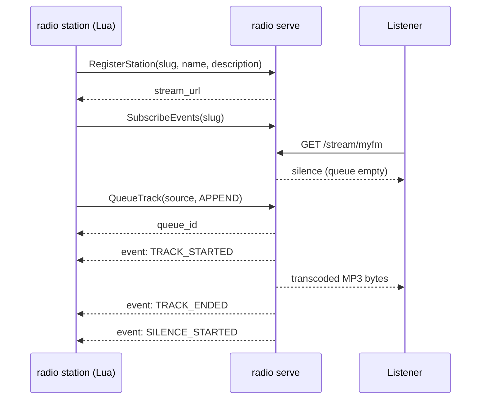

# Quickstart

This walks through running the audio server and a Lua-scripted station
controller locally, end to end.

## 1. Configure and start the audio server

```sh
cp configs/server.example.yaml server.yaml
```

At minimum, edit `server.yaml` and set a real `auth.jwt_secret` (this is
the shared secret every station controller's token must be signed with).
See [Audio server configuration](../configuration/server-config.md) for
every field.

```sh
./bin/radio serve --config server.yaml
```

On boot, the server generates a looping silence clip, then starts listening
for gRPC control-plane connections and HTTP listeners. No stations exist
until a controller registers one.

## 2. Mint a token for your station

Every station controller authenticates with a JWT whose claims list the
station slugs it's allowed to control. Mint one with:

```sh
./bin/radio tokengen -secret <jwt_secret> myfm
```

This prints a signed token authorizing the slug `myfm`. You can authorize
several slugs with one token: `radio tokengen -secret ... myfm otherfm thirdfm`.

## 3. Configure and run a station controller

```sh
cp configs/station.example.yaml station.yaml
```

Paste the token from step 2 into `station.yaml`'s `auth.jwt`, and set
`station.slug` to match (`myfm` in this example). See
[Station configuration](../configuration/station-config.md) for every field.

```sh
./bin/radio station --config station.yaml \
  --script testdata/station-scripts/example.lua \
  myfm "My FM"
```

The trailing `myfm "My FM"` arguments aren't parsed by the CLI at all —
they're handed straight to the Lua script as `radio.args`, which is how the
bundled `example.lua` picks its slug and display name. This is what lets
one script serve many different stations depending on how it's invoked; see
[Lua Scripting API](../lua-api/index.md).

## 4. Listen

```
http://<http.listen_addr>/stream/myfm
```

Open that URL in `mpv`, `ffplay`, a browser `<audio>` tag, or point any
in-game/radio-app stream setting at it. You should hear silence until the
example script's first `radio.every(...)` timer fires and queues a test
clip.

## What just happened



Next: skim the [CLI Reference](../cli/serve.md) for every flag, or dive into
the [Lua Scripting API](../lua-api/index.md) to write your own station
logic.
