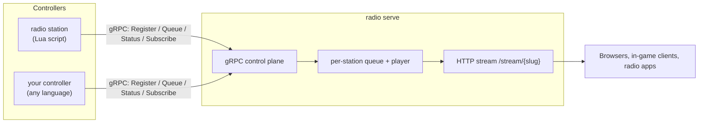

# GoRadio

GoRadio is a lightweight, general-purpose radio streaming server, packaged
as a single `radio` binary that plays two roles:

- **`radio serve`** — the **audio server**. Hosts stations, transcodes and
  hard-cuts queued audio via `ffmpeg`, and streams MP3 over plain HTTP
  (ICY-style headers) to browsers, in-game clients, and radio apps. Plays a
  looping silence clip whenever a station's queue is empty.
- **`radio station`** — a **station controller**. Runs one Lua script per
  process which decides *what* to queue and *when*, using a small `radio`
  API with full HTTP and MySQL access available to the script.

The two talk over a JWT-authenticated gRPC control plane. That protocol is
published to a Buf Schema Registry, so a controller doesn't have to be
Lua — anything that can speak gRPC works. See
[Developer / Protocol API](developer-api/index.md) if you want to write a
controller in another language.

## Where to start

- :material-download: **[Installation](getting-started/installation.md)**

    Prerequisites and how to build the `radio` binary.

- :material-rocket-launch: **[Quickstart](getting-started/quickstart.md)**

    Boot the audio server, mint a token, run a station.

- :material-script-text: **[Lua Scripting API](lua-api/index.md)**

    The `radio` table your station scripts use to register, queue, and react to events.

- :material-code-braces: **[Developer / Protocol API](developer-api/index.md)**

    Write a controller in any language against the gRPC protocol.

## How it fits together

## Known gaps

GoRadio is still early. Worth knowing before you rely on it:

- Hard cut only — no crossfade yet (the `Transition` field is reserved for it).
- No ICY mid-stream metadata (song titles) — headers only.
- No TLS on the gRPC transport this phase (plaintext + JWT auth).
- No bundled genre-specific content logic (songs/idents/DJ chatter/callers/adverts)
  yet — `radio station` gives you the primitives to build that yourself in Lua today.
